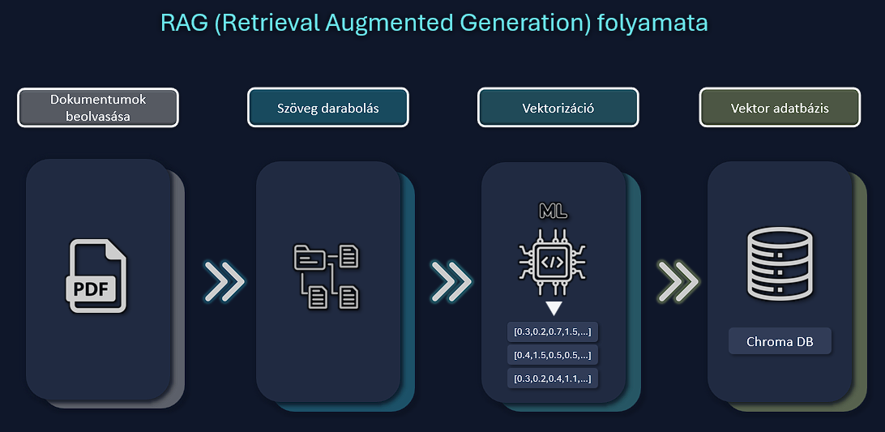
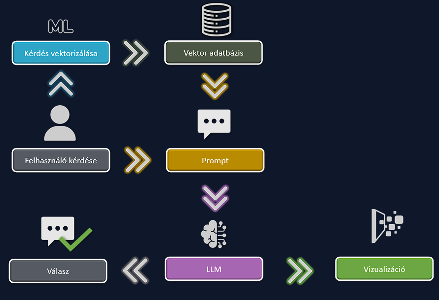

# RAG-alapú oktatást segítő asszisztens rendszer

Ez a projekt egy egyetemi féléves munka keretében kifejlesztett **RAG-alapú (Retrieval-Augmented Generation), interaktív oktatási asszisztens webalkalmazás**, amely a **Streamlit, LangChain, ChromaDB és Google Gemini** technológiákra épül.

A szoftver elsődleges célja a digitális tananyag-feldolgozás: a feltöltött PDF dokumentumokból intelligens indexeléssel automatikus strukturált összefoglalókat, tanulókártyákat és zárthelyi feladatsorokat generál, miközben a chatbot válaszai mellé tiszta, szöveges kódból valós idejű magyarázó diagramokat készít (4 különböző vizualizációs motor segítségével).

A rendszer egy fejlett **RAG (Retrieval-Augmented Generation)** pipeline-ra épül:
1. **Adatbevitel (Indexelés):** A PDF dokumentumokat a rendszer beolvassa, kisebb szövegrészletekre (chunks) darabolja, majd a `gemini-embedding-001` modellel vektorizálja és a **ChromaDB** vektoradatbázisban tárolja el.
2. **Keresés és Optimalizálás:** A felhasználói kérdés alapján a rendszer **MMR (Maximal Marginal Relevance)** alapú kereséssel kinyeri a kontextust, amit egy **CrossEncoder Reranker** modellel újra-rangsorol. Ez a mérnöki megoldás radikálisan csökkenti a hallucinációkat.
3. **Generálás:** A **Google Gemini LLM** a finomhangolt promptok és a kinyert kontextus alapján szöveges választ, valamint diagramkódot generál.


## 🗄️ Rendszerarchitektúra
### Hogyan működik a RAG rendszer?
**1️⃣ Indexelés – Adatbeviteli fázis**




**Lépései:**

1. **Dokumentum beolvasása** – Feltöltjük a PDF forrásanyagot és beolvassuk a tartalmát.

2. **Chunkolás** – A szöveget kisebb egységekre daraboljuk a pontosabb kereshetőség érdekében.

3. **Vektorizálás** – A szövegrészleteket vektorokká (számsorokká) alakítjuk a `gemini-embedding-001` modellel.

4. **Tárolás** – A vektorokat a **ChromaDB** vektoradatbázisban tároljuk el.

**2️⃣ Lekérdezés – Válaszadási fázis**



**Lépései:**
1. **Kérdés feldolgozása** – A felhasználó kérdését a rendszer szintén vektorizálja.
2. **Releváns tartalom keresése** – A ChromaDB-ből kikeressük a kérdéshez leginkább illő szövegrészleteket.
3. **Prompt összeállítása** – A kérdés és a kinyert kontextus egyesül egy komplex utasítássá az AI számára.
4. **Válasz és vizualizáció** – Az LLM generálja a szöveges választ és a témához illő diagramot.


## 🛠️ Támogatott Vizualizációs Motorok

Az alkalmazás egyedülálló tulajdonsága, hogy a kérdés jellege alapján képes 4 különböző vizualizációs motort meghajtani valós időben:

* **🐚 Mermaid.js:** Folyamatok, szekvenciák, állapotgépek és fogalmi térképek leírására.
* **🕸️ Graphviz:** Komplex irányított gráfok, hálózati topológiák  döntési fák és színes fogalmi térképek ábrázolására.
* **📊 ECharts:** Interaktív, egérrel mozgatható statisztikai diagramok (oszlop- és kördiagramok) modern, élénk színekkel JSON alapon.
* **📐️ PlantUML:** Fogalmi térképek, állapotgépek, szekvenciák és aktivitás diagramok strukturált rendszerek és folyamatok oktatási ábrázoláshoz.

> **Stabilitási megjegyzés:** Mivel a diagramok kódját a  nagy nyelvi modell (LLM) valós időben generálja, a rendszer szigorú rendszerszintű szabályokkal (System Prompts) és egyedi JSON sémákkal kényszeríti ki a helyes szintaxist a hibák minimalizálása érdekében.


## 🚀 Telepítési és futtatási útmutató

### Előfeltételek
A futtatáshoz szükség van egy érvényes **Google Gemini API kulcsra** (ingyenesen igényelhető a Google AI Studio felületén), valamint a gépre telepített **Python 3.10+** verzióra.

### 1. Projekt letöltése
Klónozd a tárolót, vagy töltsd le a forráskódot ZIP formátumban, majd lépj be a projekt mappájába:
```bash
git clone <repository-url>
cd <repository-folder>
```

### 2. Környezet felállítása és indítása
A projekt futtatásához egy izolált virtuális környezetre (venv) van szükség. Válaszd ki a számodra megfelelő környezetet az alábbiak közül:

## 🔵 Opció A: PowerShell (Kézi telepítés)
Nyiss egy PowerShell terminált a projekt mappájában, majd futtasd az alábbi parancsokat:

```
# 1. Virtuális környezet létrehozása
py -m venv venv

# 2. Függőségek telepítése
.\venv\Scripts\python.exe -m pip install -r requirements.txt

# 3. Webalkalmazás indítása
.\venv\Scripts\python.exe -m streamlit run webapp.py
```

## 💻 Opció B: CMD (Sima Parancssor)
Nyiss egy hagyományos Parancssort a projekt mappájában, majd futtasd az alábbi parancsokat:

```
# 1. Virtuális környezet létrehozása
py -m venv venv

# 2. Függőségek telepítése
venv\Scripts\python.exe -m pip install -r requirements.txt

# 3. Webalkalmazás indítása
venv\Scripts\python.exe -m streamlit run webapp.py
```

## 🟩 Opció C: PyCharm 
Nyisd meg a projektet: **File -> Open...** -> Válaszd ki a projekt mappáját.

Automatikus módszer: A PyCharm automatikusan feldobja a **„Creating Virtual Environment”** ablakot. Itt ellenőrizd a beállításokat, majd nyomj **OK-t**.

Manuális módszer (ha nem ugrik fel az ablak):

Menj a **File -> Settings -> Python Interpreter menübe**

A jobb felső sarokban kattints az **Add Interpreter -> OK** opcióra a környezet létrehozásához.

Ha a folyamat végigért, a projekt mappájában létrejön a **.venv** mappa.

Indítás: Kattints a bal alsó sarokban lévő **Terminal** fülre, majd írd be:

```
streamlit run webapp.py
```

💡 Hibaelhárítás PyCharmban: Ha a kód valamiért hibát jelez vagy hiányol egy csomagot, futtasd a PyCharm belső termináljában a ```pip install -r requirements.txt``` parancsot.

## 🟦 Opció D: Visual Studio Code
Nyisd meg a projekt mappáját: **File -> Open Folder...**

Nyisd meg a parancspalettát a **CTRL + SHIFT + P**  billentyűkombinációval.

Írd be a keresőbe: **Python: Create Environment...**

**Válaszd ki a felajánlott első lehetőséget (vagy a venv-et). Ha a VS Code felhozza a requirements.txt-t, pipáld be, hogy automatikusan telepítse a függőségeket.**

Indítás: Nyiss egy új terminált (Terminal -> New Terminal), majd futtasd:

```
streamlit run webapp.py
```
💡 Hibaelhárítás PyCharmban: Ha a kód valamiért hibát jelez vagy hiányol egy csomagot, futtasd a PyCharm belső termináljában a ```pip install -r requirements.txt``` parancsot.

## 📖 Használati útmutató 

Az alkalmazás gördülékeny kezelése érdekében kövesd az alábbi folyamatot:

> ### 1️⃣ API kulcs beállítása
> Add meg a **Gemini API kulcsodat** a bal oldali oldalsáv beállításainál. Érvényes kulcs nélkül az AI funkciók és a generálás nem működnek.

> ### 2️⃣ Dokumentum feltöltése
> Navigálj a **Dokumentum** oldalra és tölts fel egy PDF formátumú tananyagot. A rendszer ebből építi fel a helyi vektoradatbázist (ChromaDB), az AI szigorúan csak ebből a forrásból fog dolgozni.

> ### 3️⃣ Kérdés feltevése
> A **Chat + Vizualizáció** oldalon írd be a kérdésedet. A RAG rendszer kikeresi a releváns szövegrészleteket, majd ezek alapján tűpontos választ ad.

> ### 4️⃣ Diagram értelmezése
> A szoftver minden generált választ automatikusan egy vizuális ábrává is átalakít a jobb érthetőségért. A diagram típusa (Mermaid, Graphviz, ECharts, PlantUML) a feltett kérdés kontextusához igazodik.

> ### 5️⃣ Jegyzetek letöltése
> A tanulási folyamat végén a beszélgetéseket, kérdés-válasz párokat és az összefoglalókat a **Jegyzetek** oldalon **PDF formátumban** letöltheted.

⚠️ **Fontos szabály:** Egyszerre csak egy dokumentumot töltsünk fel!
